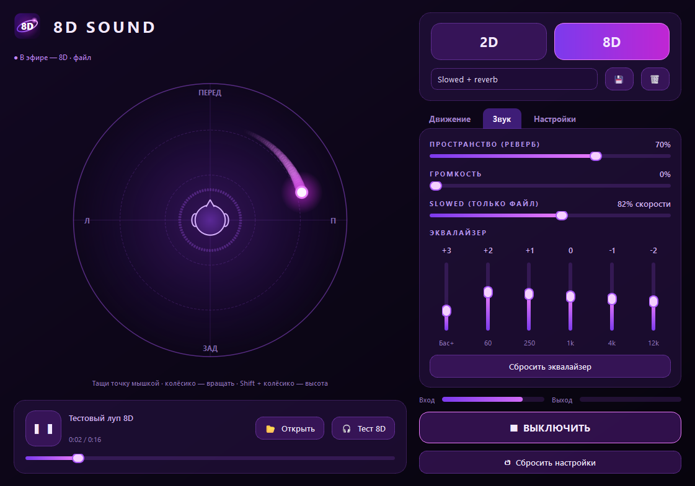

# 💜 8D Sound

Делает **любой звук Windows** (Spotify, YouTube, игры, что угодно) объёмным — **8D**: музыка кружит вокруг головы или стоит там, куда ты её перетащил мышкой.



## Возможности
- **Пресеты:** Классика 8D, Концертный зал, Шёпот у уха, Под водой, Космос, Slowed + reverb, Бас-качалка — и сохранение своих
- **Высота:** звук уходит вверх/вниз над головой (Shift + колёсико), качание по высоте
- **Эквалайзер** на 5 полос + бас-буст
- **Slowed + reverb** для файлов
- **Трей:** работает в фоне, меню вкл/выкл, 2D/8D, пресеты
- **Автозапуск** с Windows, настройка **буфера** (20–300 мс) против заиканий
- **Два источника:** 🖥 *весь звук ПК* (через VB-Cable) или 🎵 *файл* (mp3/wav/flac/ogg — работает без всяких кабелей)
- Встроенный плеер: перетащи трек в окно, пробел — пауза, перемотка, кнопка **«Тест 8D»** для проверки
- Индикаторы входа/выхода и подсказка, если сигнал не приходит
- **2D / 8D** — переключение одной кнопкой, с плавным переходом
- **Авто-вращение**: круг, восьмёрка, маятник, спираль + скорость
- **Вручную**: хватаешь точку на круге и тащишь — звук идёт за ней (спереди / сзади / слева / справа, близко / далеко)
- Настоящий бинауральный звук: разница громкости и задержки между ушами, «тень головы», приглушение сзади, бас остаётся по центру
- **Пространство** — реверберация зала
- Спектр-визуализатор вокруг головы, настройки сохраняются

## Быстрая проверка
Нажми **🎧 Тест 8D** — заиграет луп, и ты услышишь, как он кружит вокруг головы. Или перетащи в окно любой mp3.

## Весь звук ПК
1. Установи **[VB-Cable](https://vb-audio.com/Cable/)** (бесплатный виртуальный аудиокабель).
2. Открой 8D Sound: «Откуда брать» = **CABLE Output**, «Куда выводить» = **твои наушники**.
3. Жми **Включить** — приложение само переключит звук Windows на кабель, и **весь** звук компа станет 8D. При выключении/закрытии всё вернётся обратно. 🎧

> Если индикатор «Вход» пустой, а музыка играет — перезапусти плеер (Яндекс Музыка, Discord, браузер иногда держатся за старое устройство).

### Готовый .exe
Скачай `8DSound.exe` в [Releases](../../releases).

### Из исходников
```bash
pip install -r requirements.txt
python main.py
```

### Сборка .exe
```bash
pip install pyinstaller
pyinstaller --onefile --windowed --name 8DSound --icon icon.ico --hidden-import comtypes.stream main.py
```
